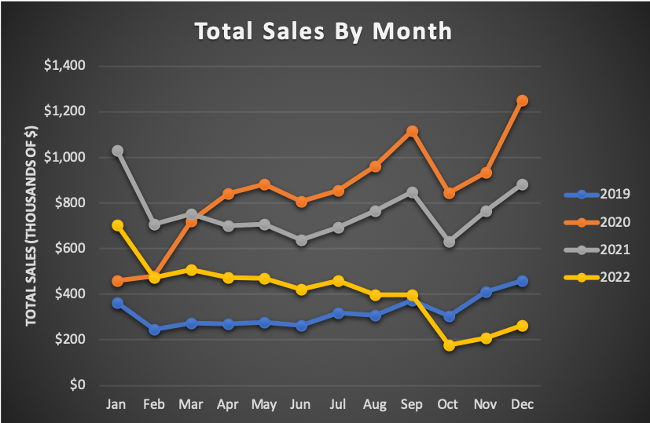
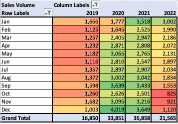
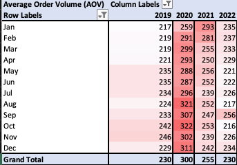
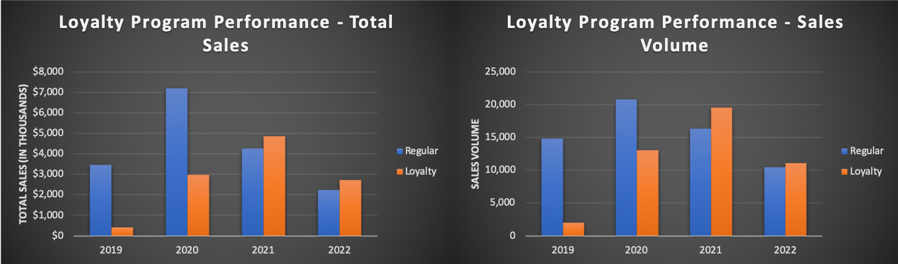
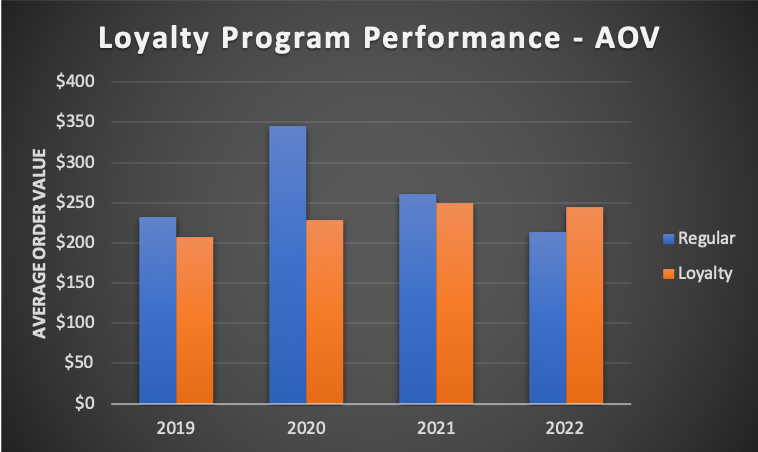
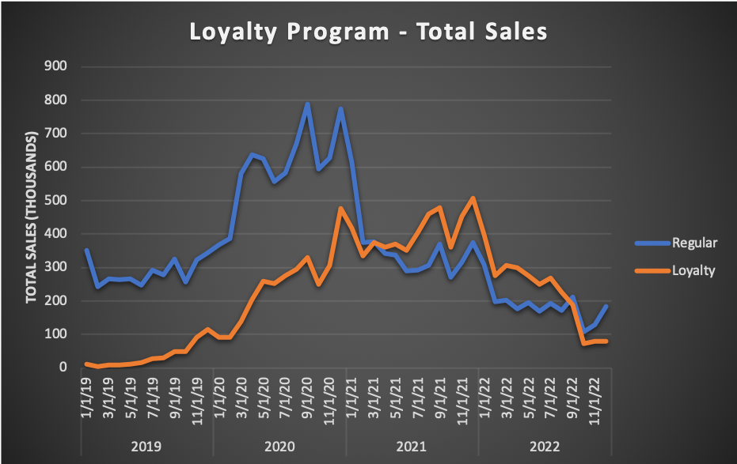
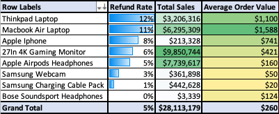
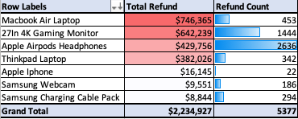

# ElectroniCart Sales Analysis
## Objective and Background
ElectroniCart is an online electronics retailer. The company has collected a wealth of data from 100k+ orders since being established in 2019.  So far, the dataset is underutilized, and this project aims to provide insights and recommendations on the following key areas:

1) **Overall Sales Trends**
    * North Star Metrics (NSM)
        * Total sales
        * Average order value (AOV)
        * Sales volume
    * Seasonality
        * How do the NSMs change over time?
        * Which month(s) see the highest or lowest NSMs?
    * Loyalty Program Performance
        * How do the NSMs compare for regular vs. loyalty customers?
2) **Refunds**
    * North Star Metrics (NSM)
        * Total amount refunded
        * Refund rate
        * Average order value (AOV)
    * How do the NSMs change for each product?
        * Do certain products have a high return rate?
        * Are certain products being returned more frequently than others?
    * How does the amount refunded affect ElectroniCart's bottom line?
3) **Category 3**
    * Coming Soon

## Data Quality
The dataset required cleaning before analysis as there were several data quality issues relating to inconsistent formatting, missing values, and more.  Documentation on these issues and their resolution is [here INSERT LINK LATER](www.google.com_).

## Dataset Structure
The dataset initially came as an [Excel workbook](https://github.com/papir805/ElectroniCart-Sales-Analysis/blob/master/data/electronicart_data_cleaned.xlsx) containing 108,127 records with order ID as the table grain. Thus, each record represents a unique order, although it should be noted that each unique order (order ID) contains only a single item.

**Table 1)** *Fields relevant to analysis*
| Field Label | Data Type | Example | 
|---|---|---|
| order_id | string | 5f87a27686c1
| purchase_ts,   ship_ts,   delivery_ts,   refund_ts | date | 2020-04-28
| product_name | string | Thinkpad Laptop
| usd_price | float | 434.05
| country_code | string | JP
| region | string | APAC
| loyalty | boolean | loyalty = 1   regular = 0

## Insights Summary

### Overall Sales Trends:
**Overview**: ElectroniCart experienced staggering annual sales growth in 2020 (163%) when the pandemic started, and more people placed orders at home. Sales slowly decreased in 2021 (10%) and dropped sharply in 2022 (46%) as lockdowns eased and people progressively returned to normalcy.

**Table 2)** *Minimum and Maximum Annual Sales*
| Year | Lowest Monthly Total Sales | Highest Monthly Total Sales
|:------:|:-----:|:-----:
| 2019 | $247,000 | $458,000
| 2020 | $460,000 | $1,252,000 
| 2021 | $632,000 | $1,030,000
| 2022 | $178,000 | $705,000

#### Seasonality
##### Total Sales:

* Sales tend to fall slowly from January until May or June, then pick up until reaching their maximum at the end of the year.  The only exception is 2020 when COVID lockdowns were in full effect.
* All years exhibit a drop in sales from September to October, ranging from 18 to 55%.
* Sales were highest in 2020 and 2021, likely due to the increased number of people being home when COVID lockdowns were in full effect. Sales before COVID-19 in 2019 and after COVID-19 in 2022 show similar sales levels, indicating that consumer purchasing behavior may have returned to normal.
* Unfortunately for ElectroniCart, the most recent data shows sales are at an all-time low.

##### Sales Volume:

* Sales volume in 2020 reached its highest point in December and experienced continued growth throughout 2020.  Sales volume slowly declined throughout 2021 and 2022 and **is now lower than most pre-pandemic levels**.
    * **October and November 2022 have the lowest sales volume since the company was established**.

##### Average Order Value (AOV):

* AOV was consistently high throughout 2020 and much of 2021.  A combination of high AOV and high sales volume made these two years extremely successful.

#### Loyalty Program:
Since the loyalty program's implementation in 2019, performance across total sales and sales volume mirrors the general trends established earlier. They both increase at first and then gradually decrease for regular and loyalty customers.

  

Overall, 2019 and 2020 see more robust performance for regular customers, although this switches in 2021 and carries into 2022, where loyalty customers have higher total sales and more sales volume.

AOV experiences the same trend, increasing initially and then gradually decreasing, but loyalty customers are more resilient. From 2020 to 2021, AOV decreased by 24% for regular customers yet increased by 10% for loyalty customers. Between 2021 and 2022, AOV decreased by 24% more for regular customers, whereas it only dropped by 2% for loyalty customers.

Total sales dropped significantly for regular customers in early 2021 when it was eclipsed by loyalty customer spending.  Loyalty spending remaing on top throughout the rest of 2021 and 2022 until spending for both types of customers drops at the end of 2022.

### Refunds

* The four items with the highest refund rates are:
    * Thinkpad Laptop
    * Macbook Air Laptop
    * Apple iPhone
    * 27in 4K Gaming Monitor
* On average, about 5% of orders get refunded. However, the refund rate is much higher than average for the Thinkpad Laptop (12%), Macbook Air Laptop (11%), and Apple iPhone (8%).
    * These items have the highest AOV at $1,588, $1,100, and $741, respectively, and each return has the potential to significantly affect ElectroniCart's revenue.
    * Despite a high refund rate and AOV, the Apple iPhone represents a tiny chunk of ElectroniCart's sales and has a negligible impact on dollars refunded.
* **Important observation: While unrelated to returns, it's worth noting that the Bose Soundsport Headphones sold only about $3,000 between 2019 and 2022 and had by far the worst sales performance of any item ElectroniCart sells.**

* Four items make up the vast majority (98%) of dollars refunded:
    * Macbook Air Laptop
    * 27in 4K Gaming Monitor
    * Apple Airpods Headphones
    * Thinkpad Laptop
* The Macbook Air Laptop and Thinkpad Laptop significantly contributed to dollars refunded and were noted to have high refund rates earlier.
* The 27in 4K Gaming Monitor and Apple Airpods Headphones have low refund rates but are the most frequently refunded item, constituting 48% of dollars refunded.
* The Macbook Air Laptop, the Apple Airpods Headphones, the Thinkpad Laptop, and the 27in 4K Gaming Monitor account for 8% of all sales and represent $2.2 million in dollars refunded between 2019 and 2022.

## Recommendations
Based on the insights listed above, the company should consider the following recommendations:

### Sales Team
* Increase promotions during late spring and summer to increase sales during slower times.
* Investigate why sales drop between September and October. Look for ways to stimulate sales.
* Collaborate with the loyalty team to identify:
    * Why spending for regular customers dropped in early 2021 while loyalty spending continued to increase.
    * Why spending for both types of customers decreased in late 2022.

### Loyalty Team
* Continue the loyalty program:
    * Identify ways to increase the number of participating users.
    * Identify ways to increase AOV.

### Inventory Team
* Start tracking reasons for customer returns and identify why certain products get returned more frequently and fix those issues.  High return rates for certain items, like the Macbook Air Laptop and Thinkpad Laptop, or high return volume for other items, like the Apple Airpods Headphones and 27in 4K Gaming Monitor, are eating away at ElectroniCart's bottom line.
* Phase out the sale of Bose Soundsport Headphones due to poor sales performance.  

