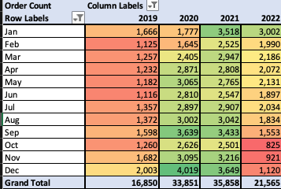

# ElectroniCart Sales Analysis
## Objective and Background
ElectroniCart is an online electronics retailer. Since the company was established in 2019, they've collected a wealth of data from 100k+ orders, which is currently being underutilized.  This project aims to analyze the dataset and provide insights and recommendations on the following key areas:

* **Overall Sales Trends**
    * North Star Metrics (NSM):
        * Total sales, average order value (AOV), and product order counts
    * Seasonality:
        * How do the NSMs change over time?
        * Which month(s) see the highest or lowest NSMs
    * Segmentation Analysis:
        * How do the NSMs change with respect to country or region?
    * Loyalty Program Performance
        * How do the NSMs compare for regular vs. loyalty customers?
* **Category 2**
    * Coming Soon
* **Category 3**
    * Coming Soon

## Dataset Structure
The dataset initial came as an [Excel workbook INSERT LINK HERE](www.google.com) containing 108,127 records with a table grain of order ID.  Each record represents a unique order, although it should be noted that each order ID  contains only a single item.  The fields relevant to the analysis are as follows:

| Field Label | Data Type | Example | 
|---|---|---|
| order_id | string | 5f87a27686c1
| purchase_ts,   ship_ts,   delivery_ts,   refund_ts | date | 2020-04-28
| product_name | string | Thinkpad Laptop
| usd_price | float | 434.05
| country_code | string | JP
| region | string | APAC
| loyalty | boolean | loyalty = 1   regular = 0

## Data Quality
Prior to the analysis, the dataset required cleaning as there were several data quality issues relating to inconsistent formatting, missing values, and more.  These issues and how they were resolved have been documented [here INSERT LINK LATER](www.google.com_).

## Insights Summary

### Sales:
**Overview**: ElectroniCart experienced staggering sales growth (163%) in 2020 when the pandemic started and more people were at home placing orders.  Sales slowly started to decrease in 2021 (10%) and dropped more sharply (46%) in 2022 as lockdowns were eased and people progressively returned back to normalcy.
| Year | Lowest Monthly Sales | Highest Monthly Sales
|:------:|:-----:|:-----:
| 2019 | $247,000 | $458,000
| 2020 | $460,000 | $1,252,000 
| 2021 | $632,000 | $1,030,000
| 2022 | $178,000 | $705,000

      
#### Seasonality:

* Sales tend to fall slowly from January until May or June, then pick up until reaching their maximum at the end of the year.
* Sales consistently drop anywhere from 18-55% from September to October
* Sales were highest in 2020 and 2021, likely due to the increased number of people being home when COVID lockdowns were in full effect.  Sales before COVID, in 2019 and after COVID, in 2022, show similar sales levels, indicating consumer purchasing behavior may have returned to normal levels.
* Unfortunately for ElectroniCart, the most recent data shows sales are at an all time low.

### Order Count:

* Order volume in 2020 reached it's highest point in December and experienced continued growth throughout 2020.  Order volume slowly declined throughout 2021 and 2022 and is now lower than pre-pandemic levels.
    * October and November 2022 have the lowest order volume since the company was established.
