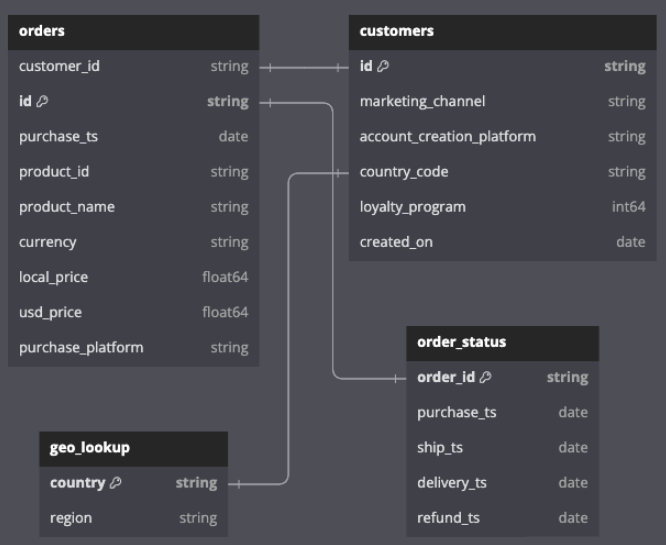
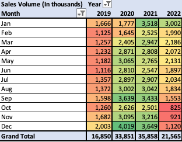
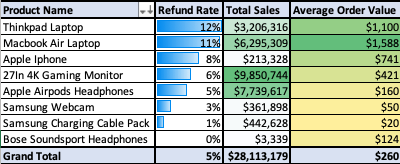
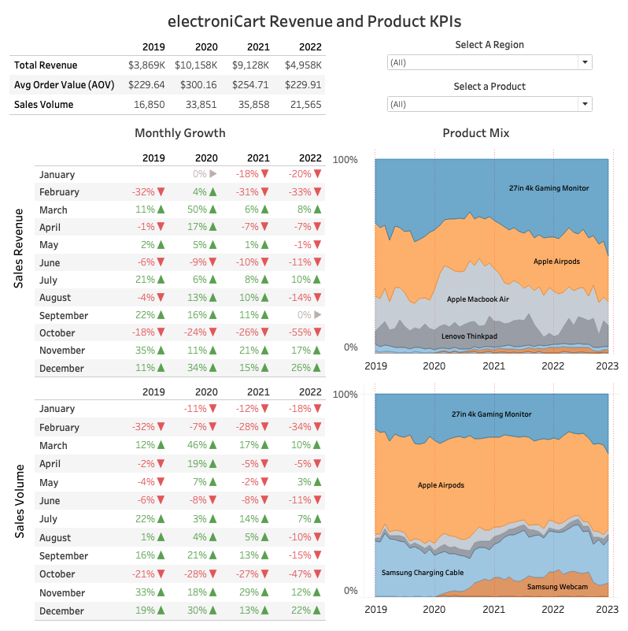
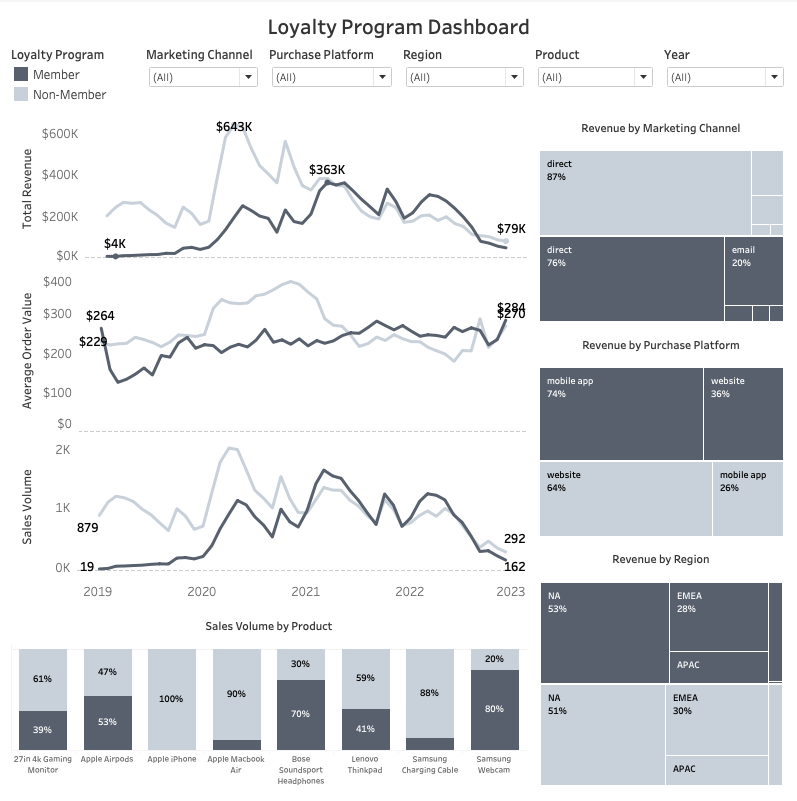

# ElectroniCart Sales Analysis
## Objective and Background
ElectroniCart is an online electronics retailer.  The company has collected a wealth of data from 100k+ orders since being established in 2019.  So far, the dataset is underutilized, and this project aims to provide insights and recommendations on the following key areas:

1) **Sales**
    * Key Performance Indicators (KPIs)
        * Total sales
        * Sales volume
    * Product Mix
        * Which items contribute most to total sales?
        * Which items are purchased most frequently?
    * Seasonality
        * How do the KPIs change over time?
        * Which month(s) see the highest or lowest KPIs?
    * Loyalty Program Performance
        * How do the KPIs compare for loyalty vs. non-loyalty customers?
2) **Refunds**
    * Key Performance Indicators (KPIs)
        * Dollars refunded
        * Refund rate
        * Average order value (AOV)
    * How do the KPIs change for each product?
        * Which products have the highest return rates?
        * Which products are returned most frequently?
    * How do dollars refunded affect ElectroniCart's bottom line?

## Data Quality
The dataset required cleaning before analysis.  There were data quality issues relating to inconsistent formatting, missing values, and more.  Documentation on these issues and their resolution is [here](./issue_log.md){:target="_blank"}.

## Dataset Structure
**The dataset initially came as an [Excel workbook](./data/electronicart_data_cleaned_final.xlsx) containing 108,127 records**.  Order ID is the table grain, and each record represents a unique order.  

After cleaning, **the dataset was uploaded to a Google BigQuery database for more advanced analysis in [SQL](./sql_queries.sql)**.  The schema consists of four tables: orders, customers, geo_lookup, and order_status.

<!-- | Field Label | Data Type | Example | 
|---|---|---|
| order_id | string | 5f87a27686c1
| purchase_ts | date | 2020-04-28
| ship_ts | date | 2021-09-04
| delivery_ts | date | 2019-03-07
| refund_ts | date | 2022-05-21
| purchase_ts | date | 2020-04-28
| ship_ts | date | 2021-09-04
| delivery_ts | date | 2019-03-07
| refund_ts | date | 2022-05-21
| product_name | string | Thinkpad Laptop
| usd_price | float | 434.05
| loyalty | boolean | loyalty = 1   non-loyalty = 0 -->

# Sales Insights

## Overview
 **ElectroniCart experienced staggering annual sales growth in 2020 (+163%)** when the pandemic started, and more people were placing orders from home. **Sales decreased in 2021 (-10%) and dropped sharply in 2022 (-46%)** as lockdowns eased and people progressively returned to normalcy.

## Sales Volume

<em>Sample pivot table.  Other tables are linked below in their relevant sections.</em>

Sales volume grew steadily throughout 2020, reaching its highest point in December 2020, but declined throughout 2021 and 2022 and is now lower than most pre-pandemic levels. **Two out of three of the most recent months have the lowest sales volume in the company's lifetime**.

## Product Mix
Between 2019 and 2022, **four items constitute 96% of all sales**: 
* 27in 4K Gaming Monitor (35%)
* Apple Airpods Headphones (28%)
* Macbook Air Laptop (22%)
* Thinkpad Laptop (11%)

**The Bose Soundsport Headphones is the worst performing, only selling ~$3,000** ([figure 1](./images/product_mix.png)).

## Seasonality
Starting in January, **sales fall until reaching their lowest point in May/June**, and then pick up **until September to October, when they drop anywhere between 18% to 55%.**  Sales rebound in the remaining months and finish the year strong.  

**These patterns were more volatile in 2020 and 2021**, likely due to the increased number of people being home when COVID lockdowns were in full effect, but **sales before COVID-19 in 2019 and after COVID-19 in 2022 show similar sales levels, indicating that consumer purchasing behavior may have returned to normal** ([figure 2](./images/sales_by_year.png)).

## Loyalty Program ([SQL Queries](./sql_queries.sql))
**When first introduced in 2019, loyalty program customers underperformed compared to non-loyalty customers, although this switches in 2021 and carries into 2022**.  Now, loyalty customers have higher total sales and more sales volume than non-loyalty customers  ([figure 3](./images/loyalty_hist_total_sales_and_sales_volume_vertical.png)).

Although total sales and sales volume dropped from 2021 to 2022 for both customer types, loyalty customers' AOV has been more resilient to change.  From 2020 to 2021, AOV decreased by 24% for non-loyalty customers yet increased by 10% for loyalty customers.  Between 2021 and 2022, AOV fell an additional 24% for non-loyalty customers while only dropping by 2% for loyalty customers.  On average, **loyalty customers now spend $30 more per order** ([figure 4](./images/loyalty_hist_aov.png)) **and place orders 60 days more quickly than non-loyalty customers**.

# Refund Insights

## Refund Rates
On average, ~5% of orders get refunded. However, several items have much higher refund rates: 
* Thinkpad Laptop (12%)
* Macbook Air Laptop (11%)
* Apple iPhone (8%) 

**Despite a high refund rate, the Apple iPhone represents a tiny chunk of ElectroniCart's sales (~1%), and returns have a negligible impact on dollars refunded**.

## Dollars Refunded
Four items make up nearly all (99%) of the dollars refunded:
* Macbook Air Laptop (33%)
* 27in 4K Gaming Monitor (29%)
* Apple Airpods Headphones (19%)
* Thinkpad Laptop (17%)

Because **the Thinkpad and Macbook Air Laptop have high AOVs and high refund rates**, their returns significantly threaten ElectroniCart's revenue. **The 27in 4K Gaming Monitor and Apple Airpods Headphones** had low refund rates, but **have a high refund frequency**, also contributing to lost sales revenue.  

**Returns of the Macbook Air Laptop, the Apple Airpods Headphones, the Thinkpad Laptop, and the 27in 4K Gaming Monitor constitute 8% of all sales and represent $2.2 million in dollars refunded between 2019 and 2022**
([figure 5](./images/refunds_percent_dollars_refunded_and_refund_count.png)).

# Recommendations
Based on the insights listed above, the company should consider the following recommendations:

## Sales Team ([SQL Queries](./sql_queries.sql))
* Increase promotions during May, June, and July to increase sales during historically slow months.
* **Investigate why sales of *all* products consistently experience average drops in sales volume between 14% - 47% from September to October**, particularly for these three traditionally best-selling items: 
    * ThinkPad Laptop (-47%)
    * Apple Airpod Headphones (-31%)
    * 27in 4k Gaming Monitor (-31%)
* Collaborate with the loyalty team to identify why spending and AOV for loyalty customers have eclipsed non-loyalty customers since 2021.

## Loyalty Team ([SQL Queries](./sql_queries.sql))
* Continue the loyalty program and expand its offerings to increase the number of participating users and AOV, especially given the switch from underperforming to overperforming in 2021.
    * **Average shipping times for non-loyalty customers (5.502 days) are nearly identical to those of loyalty customers (5.504 days)**.  Consider partnering with shipping carriers to offer faster shipping methods for loyalty customers to incentivize new signups.
* **Cut social media and affiliate marketing channel spending** for poor conversion rates, 1.06% and 1.53%, respectively, when successfully signing up new loyalty program members, **in favor of direct marketing (72.76% signup rate)**.

## Inventory Team
* Start tracking reasons for customer returns and identify why certain products get returned more frequently.  Fix those issues to minimize return rates for items with high AOV, like the Macbook Air Laptop and Thinkpad Laptop, or items with high return frequencies, like the Apple Airpods Headphones and 27in 4K Gaming Monitor.
* **Phase out the sale of the Bose Soundsport Headphones** for severe underperformance.  **This item only sold 27 units, totaling ~$3,000 in revenue over four years**.   Investigate reasons for their poor sales and select new product offerings that are more likely to perform well.   

# Technical Analysis
The [Excel workbook](./data/electronicart_data_cleaned_final.xlsx) containing all pivot tables and graphs, as well as the [SQL queries](./sql_queries.sql) used to perform additional calculations are in this repository.

## Tableau Dashboards
Below are screenshots of the dashboards created for this analysis focusing on [important KPIs](https://public.tableau.com/views/electroniCart_KPI_dashboard/electroniCartRevenueandProductKPIs?:language=en-US&:sid=&:display_count=n&:origin=viz_share_link) and the [loyalty program](https://public.tableau.com/app/profile/jonathan.papir/viz/electroniCart_dashboard/KPIs?publish=yes).

 